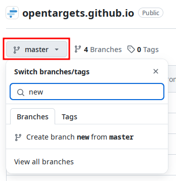
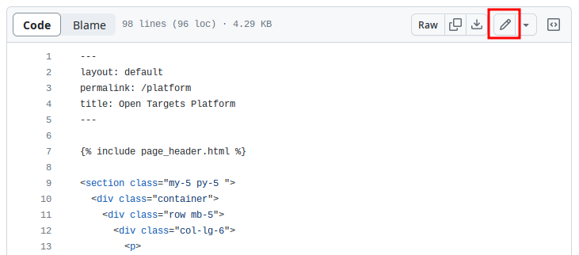

# Open Targets Corporate Website

This is a static site about Open Targets and it is built with [Jekyll](https://jekyllrb.com) and deployed thanks to [Netlify's Open Source Plan](https://www.netlify.com)

<a href="https://www.netlify.com">
  
</a>  

## Editing content directly on GitHub 

1. Create a branch - see [GitHub's documentation](https://help.github.com/articles/creating-and-deleting-branches-within-your-repository/) for more information



2. Edit the files you want to change - see [GitHub's documentation](https://help.github.com/articles/editing-files-in-your-repository/) for more information



3. When all of your changes are ready, create a pull request (PR) - see [GitHub's documentation](https://help.github.com/articles/creating-a-pull-request/#creating-the-pull-request) for more information 


## Developing in a local environment

Similarly to the [github-pages setup instructions](https://help.github.com/articles/setting-up-your-github-pages-site-locally-with-jekyll/) you can use bundler to install all dependencies, including `jekyll`:

```
gem install bundler
```

Once you have bundler installed, you can clone the repo and rely on the `Gemfile.lock` file present there:

```
git clone https://github.com/opentargets/opentargets.github.io.git
cd opentargets.github.io
bundle install
```

Now you should be able to serve the website locally at `http://localhost:4000`, watching for file changes:

```
bundle exec jekyll serve --watch
```

## Deploying on Netlify

Any PR will generate a [deploy preview](https://www.netlify.com/blog/2016/07/20/introducing-deploy-previews-in-netlify/) in Netlify. The URL for each deploy preview will show up in the comment of the PR.

The master branch is in sync with production, however deploys to production are currently locked and will not automatically sync.
When a PR to master is merged, to deploy the changes one needs to unlock/lock in the netlify interface.

## Keeping github-pages gem up-to-date

As noted in the [official GitHub pages documentation](https://help.github.com/en/github/working-with-github-pages/testing-your-github-pages-site-locally-with-jekyll#updating-the-github-pages-gem):

> Jekyll is an active open source project that is updated frequently. If the github-pages gem on your computer is out of date with the github-pages gem on the GitHub Pages server, your site may look different when built locally than when published on GitHub. To avoid this, regularly update the github-pages gem on your computer.

To update the `github-pages` gem, you can use the following command:

`bundle update github-pages`

It is a good idea to periodically update all gems using the `bundle update` command.
